# re-work: re-frame on workers

>  Rouse him, and learn the principle of his activity or inactivity. Force him to reveal himself, so as to find out his vulnerable spots. 

> -- Sun Tzu, The Art of War

## Why Should You Care About re-work?

Either:

1.  You want to develop an [SPA] in [re-frame] and run (parts or all) of it on workers.
2.  Well, that's it, really.

## re-work

re-work is the documentation of a journey towards running a re-frame app on the [WebWorkerAPI]: on [WebWorker]s, on [servant]s, on [SharedWorker]s, on [ServiceWorker]s. The application transforms and morphs into different centres of gravity throughout our voyage, implications included. re-work attempts to capture those, so you can travel faster from the start point ("I have a re-frame app and I want to use workers") to one of the multiple destinations. It is your own personal how-to and a bit of support code.

re-frame is documenting patterns for writing [SPAs] in ClojureScript, using [re-frame] and [component]s, so the application can successfully facilitate the [WebWorkerAPI].

This repo contains both a **description of these patterns** and a **reference implementation**.

To paraphrase McCoy: "It's [re-frame], Jim, but not as we know it".

To build a re-work app, you:
 - do all the things you'd do for a re-frame app (data, query, view, control layer)
 - decide which of the query, view, control layer can be grouped thematically or computationally
 - decide which of the worker use patterns and their implications fit your application
 - apply that local recipe to your application

Features:

1. See [re-frame]
2. Each of your components can be run in a separate worker (```WebWorker```, ```SharedWorker``` or ```ServiceWorker```) context
3. Your "main event loop" (the one with the critical state in its ```db```) can run in its own separate worker

## Using re-work

It's not released yet. You cannot use it yet.

## Voyage of Exploration / Table of Contents

- [What Problem Does It Solve?](#what-problem-does-it-solve)
- ( [Why fork re-frame?](#why-fork-reframe) )
- [Guiding Philosophy](#guiding-philosophy)
  - [When Events Are All You Care About](#when-events-are-all-you-care-about)
  - [Functionality of Your Application](#functionality-of-your-application)
    - [browser manipulation](#browser-manipulation)
    - [state & event handlers](#state--event-handlers)
    - [rendering](#rendering)
    - [timers](#timers)
  - [Distributing Computation](#distributing-computation)
    - [Can't we use servants?](#cant-we-use-servants)
    - [Critique & Aesthetics](#critique--aesthetics)
    - [Making our way back](#making-our-way-back)

- [Event Flow](#event-flow)
- [Dispatching Events](#dispatching-events)
- [Event Handlers](#event-handlers)
- [Routing](#routing)
- [Logging and Debugging](#logging-and-debugging)
- [Talking To A Server](#talking-to-a-server)
- [The CPU Hog Problem Revisited](#the-cpu-hog-problem-revisited)
- [In Summary](#in-summary)
- [Where Do I Go Next](#where-do-i-go-next)
- [Licence](#licence)

## What Problem Does It Solve?

When [SPA]s become richer and fatter and more featureful, it is not uncommon that some of their computations begin taking longer and longer. Particularly you quickly become in danger of overstepping the time allocated to you (implicitly) by the [re-frame] core router loop. This is known in re-frame as the "CPU hog" problem. Of course it's nothing new. Usually what we do nowadays if we have to service such a tight loop, we go into parallel universes and compute there.

It also happens that on the runtime environment that [re-frame] targets, we have means available to us to leave the main javascript context with its event handlers, and enter into our own context. This is offered by different types of [WebWorker]s. With the [WebWorkerAPI], we can launch multiple javascript contexts, and essentially communicate via message passing between these share-nothing(-by-default-but-allow-transfer-of-data) environments.

This presents us with technical challenges surrounding the [WebWorker]s themselves (the ones not detailed here are detailed under [Worker Applications](#worker-applications)). First and foremost, there is a problem with portability. Yes, only more modern browsers implement [WebWorker]s, but that's not the real problem. The real problem is that not all browser implementations agree on the extent of API available to running workers, in particular, launching further workers (they should support it, but, e.g., chrome doesn't). This documents the necessity to create the workers in the main context, and establish potential data flow dependencies manually. Furthermore, parallel access to our [SPA] now means we are re-launching these parallel workers. This may or may not be what we want to do. Plain [WebWorker]s only allow us the possibility of spawning them again and again. Luckily there are [SharedWorker]s (and [ServiceWorker]s as well, but those are even less implemented than SharedWorkers). These allow getting access to an established javascript context if the identifier of the worker matches up with an existing one.

With the tools picked, we "only" need to establish utility code that launches workers for us in the main javascript context, wires them together as necessary, dispatches to these workers and finally handle replies from the workers as well. This is where re-work comes in. re-work is about providing the utility/glue code that brings these workers together as well as documenting how to approach the problem with components and the presented code.

### Why fork re-frame?

Forking re-frame to implement add-on functionality is the most pragmatic approach right now as there need to be done a couple of modifications to the existing [re-frame] code:

1. re-frame needs to be a component to play along nicely with re-work. In particular, it can't just start the event router loop upon being required, oy!
2. The re-frame component needs to accept a dispatch function - we need to patch it together in some contexts, while we can use the plain one in others
3. whatever else comes up on the way

If/When re-frame becomes a component itself without code being run on require, this naturally can be dropped again and re-work shrinks down to the couple of files it really needs to be - re-work has no interest in duplicating and tracking re-frame's work so far and its on-going improvements.

## Guiding Philosophy

We are assuming we've all been good citizens about how we implement our application. In particular, we believe FRP is the correct approach, and the implicated "reduce" mentality of having a local state and handling a passed argument (event, ...). We also believe in some FP basics, so we are not really interested in how the computation takes place, as long as the result of the computation is handed to us. In particular, we frown upon side-effects in computational code, like state updates. State either bubbles up to the top and can be passed around, or we frown and ponder how to get rid of it.

### When Events Are All You Care About

We have prepared so all we care about is the incoming events and the local state that we need as memory. In particular, there is no need to access external, global, write-able locations. Manipulations on the browser state will be done by our rendering framework (i.e., react) for us, all we are concerned about is computing data. Leaving out the corner cases that present a somewhat "meta" challenge to your application, i.e., management of the application _itself_ (which usually require fiddling with global mutable state), the normal application flow (and its computations and side-effects) are solely represented by the initial state, events flowing through the system and the handlers that react on them.

If that is the case, we don't care _where_ we are computing the data. In particular, if we have an event router that is capable of dispatching the event to a separate js context, plus make the memory accessible (more on that later), we will happily have our event handlers run in a separate context, because all the data is available _as arguments_ to the event handler. So let's look at all the features of our re-frame app, above, and see if they would resist moving to a different js context.

### Functionality of Your Application

We have approached our problem space by dividing it into layers. Querying over our know data. Computing the derived data from our input(s) and/or state(s). Displaying the data. Concering state-ful (internal to the application) updates, we have avoided them (and grouped it in a dirty namespace called ```*.util```), because the most important side-effect of our [SPA] is changing its display.

We have structured the computational parts of our application into event handlers. The supporting code in all their namespaces is referenced in the event handlers to implement the application data flow. Essentially, from a black-box point of view, we could live with no way of calling the code. We could implement the whole functionality just by running event handlers, and updating our local application database, our reduce accumulator, with the results of our computations. The application database then would contain all the results that the caller was interested in. Let's ignore how they would get to the DB itself, and acknowledge that our event handlers suffice to implement the application.

This is what our application looks like at this point:

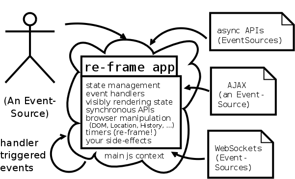

This is all fine and good, but we run into a problem when the application starts doing too much in the main js context. Too much computational pressure makes the animations stutter. And if we are to take [SPA]s serious as an application platform, we potentially want to compute a _*lot*_. So when our applications become baroque (e.g., as in "enterprise"), we'd like it to look something like this:

To get to this point, let's consider each responsibility in our source re-frame application and see what we can do with it.

#### browser manipulation

(and **synchronous**, **your side effects**)

Let's begin with the bummers first, because some things just won't be able to be moved. Webworkers carry two "deficiencies" - they cannot access the global ```window``` object (but instead have a different global scope object) and they cannot access objects manipulatively in the main js context. So when we need to do either - manipulate an existing value in the main javascript context, or access, e.g., ```window.document```, we'll have to bite the bullet and leave the work in the main context.

#### state & event handlers

In contrast, our application state is "just a value". We take this value very dearly, but nothing stops us from having it live in a different javascript context. It is getting better actually, as we can usually divide our data into either a portion per module, or a shared portion, plus additionally one portion per module. What is a module? The measure of entanglement / interdependencies of state should answer that question for us. So if each "module" has all the state it needs, in a js value, then we can not only move state management to a different js context, we can even split it up as we need it.

All we need to do is to present the event handlers with a series of evolving states that adheres to the event handlers expectations with regards the effects an event handler carries in re-frame context. So when the event handler returns a new value for the database, and another handler is called, the second handler can rightfully expect the application db it gets passed as first argument to have the adjustments of the first handler. At first sight, this applies to the whole of the app-db, yet of course the handler will only see modifications of values it actually consumes. If one group of handlers only work with data under the ```:foo``` key, and another only with data under the ```:bar``` key, the second group need not be concerned with what is actually under ```:foo``` when it is being passed the database. It follows that we can easily put the group of ```:foo``` fighters into their own js context (worker), and the ```:bar``` folk into another js context (another worker). As a word of warning, this bears the weakness of relying solely on our discipline in component structuring and using test-cases with isolated sub-app-dbs to make sure that we've sufficiently untangled the component dependencies themselves!

With groups of handlers living in different js contexts, incidentally we will need some event routing to get the events to the correct worker, handling the asynchronous nature of the workers, passing data back and forth, establish protocols for lifecycle management (if that rings a bell and we think ```com.stuartsierra.component/Lifecycle```, could we be on the right track?) 

#### rendering

This computation in the background, in foreign contexts, is all fine and good, but until we step up to witness the resulting values, they have been in vain. Rendering the data requires access to the app-db. Again, like the event handlers, not to all of it, but a crucial subset of data contains the direct (or indirect) content that we want to have rendered. This requires feeding the updates of the event handlers back together to synthesize a superset app-db that resembles the app-db of our initial re-frame application again.

Additionally, the rendering needs to manipulate the browser state, after all it is going to change the DOM that is displayed. So it needs to live in the main js context. And it needs access to the merged application state, whereas so far we have only made access to it impossible, and split up the state.

#### timers

(and other **asynchronous** APIs)

Each worker of course can have its own asynchronous entities. There is no necessity to have timers or other asynchronous code run in the main js context. All code portions involved in this can happily move to another worker, so long they stay together, or are prepared to communicate via message passing between the workers. It appears preferrable to have asynchronous API use intermingled with each other, or dependant on specific state remain within the same component (so they can easily end up on the same worker).

### Distributing Computation

After careful consideration, we are prepared to begin moving of the entangled balls of event handling, state and asynchronous into a component each, and keep in mind that this component will run in its own js context, communicating with the rest of the application only via messages. For some randome sample application of ours, we might arrive at a picture similar to the following.

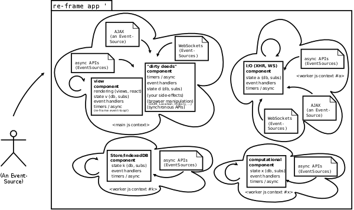

Whoa there, holy complexity. Or, is it? We'll revisit that in a bit. Let's assume this all appears too complicated, as, after all, all we went to set out was to overcome the CPU hog problem with the solutions we've learned to embrace nowadays. So, wouldn't we be served well enough by an equivalent of ```(future)```, which could take a block of code, and execute it in a different context? If all we care about is an enumeration of a fixed API interface which we want to potentially run in these futures, [servant] looks like it might just scratch our itch. So let's make a tour of exploration of this nice little library.

#### Can't we use servants?

[servant] is a cljs library which wraps (plain) [WebWorker]s and makes a set of functions defined with ```(defservantfn)``` available for "cross-js-context RPC". Additionally, it allows pool of workers, and keeps a queue of available workers (via ```core.async```) so that one might serially dispatch RPCs onto the pool of available workers (to stop our immediate daydream: the magic number (maximum amount of workers) [seems to be] lower than 20 reliably).

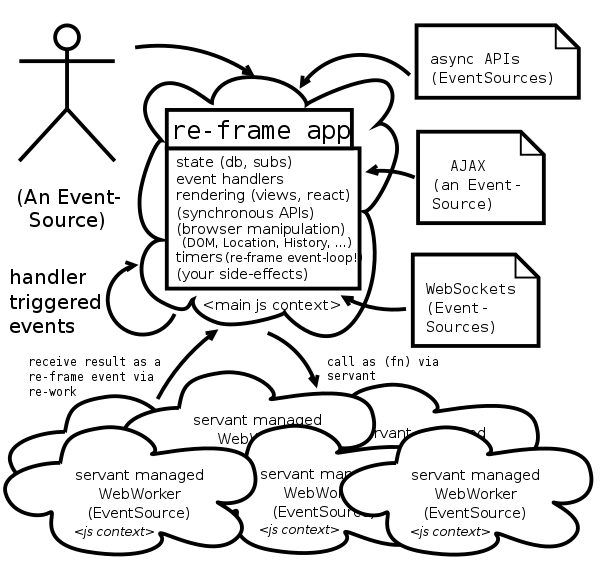

[servant] performs the following choreography:

1. It supports creating workers and loading speficied (js) sources for it (i.e., executing ```new Worker(src)```) 
2. It offers an API fn to check whether our code is running in the main js, or in a webworker context. It expects us to branch / protect execution accordingly.
3. The startup protocol involves:
  1. Creating a (```core.async```) channel that holds the available workers
  2. Creating (the requested amount of) Worker instances and putting them onto the channel
  3. We are expected to check for worker context, and in the worker context, call ```(bootstrap)```, which sets up the worker event handling to implement the servant protocol
  4. The part of our API which has been declared via ```(defservantfn)``` becomes available for dispatch to. We remember its implementations have full access to all functions, but is jailed in its own execution context.
4. In the main js context, we now have a channel of idle workers. This is passed to the dispatch / call function, ```(servant-thread)```, which takes
  - the channel of (idle) workers
  - The name of the function to call
  - An encoder fn for the servant protocol
  - the arguments for the function.
  - and returns a channel from which the function result (i.e., data returned from the foreign execution context in a way according to the servant protocol) can be consumed.

The "_servant protocol_" tips the hat to the fact that there's two ways of passing arguments between execution contexts - either perform a structured clone (a deep copy of data which can be copied, see the algorithm) or actually hand over the data to the other execution context (via the [Transferable] interface (specifically ```ArrayBuffer```s)), cf. [data transfer]. There's an obvious consideration between safety, simplicity and immutability to be had vs. extra performance here. [servant] doesn't make the choice for us, but instead offers functions to either copy (```(standard-message)```) or transfer (back and forth: ```(array-buffer-message)``` to, but not back: ```(array-buffer-message-standard-reply)```) data, and uses the encoder function as argument for the dispatch. The protocol itself just tells the receiving end which function to call, how its arguments were passed and what sort of data transfer mechanism for the reply is expected.

##### Technique 

With these tools at our disposal, we can actually tackle the CPU hog simply by dispatching our computations onto multiple servant-managed workers. With our usage of re-frame itself, we have been taught how to break up a "bigger" event handler into smaller ones - this time we are breaking it up into three sections:

1. argument handling/passing
2. the isolated computation itself
3. receiving the result of the computation

In our main js context, we initiate the passing off of data and responsibility of execution to the worker, which then begins the required computation. Once it is finished, it will return its result by notifying the main js context. Servant will put the resulting values onto the result channel. All we have to do is to get the value out once it's there, and the final considerations upon receipt of the result can be performed in the main js context. Particularly, the resulting value(s) can be stored in the application database, making them available for the views to render, further events down the road and so forth.

_**XXX**: Detail what is meant by the above: non re-frame-app - structured API calls into worker threads or worker thread pools. Slaves shall serve and all. No impact on the app itself except for the data transfer consideration (how costly is rendering & reading the data? how costly the transfer? show with sample which is the costlier and how their relative cost relates). + cljs objs cannot be natively transferred - rendering via clj->js, transit, more_

#### Critique & Aesthetics

Let's pause for a moment, take a step back, and consider where we have arrived so far. We're ready for the re-frame flow, and we're about to fork work out to additional js contexts. When using [servant], we have the option to ignore its innards, just use it and be well on our way. If we go that way, we will have to keep in mind that reading the return value of the servant fn can block, best establish an asynchronous block which puts the resulting value back into the re-frame machinery by dispatching an event via re-frame with the value as an argument. Then integrating (multiple) worker contexts works fine -- all state is passed around all the time if the foreign js context needs it, there's options for efficient data transfer between contexts, and the event loop of the worker and the re-frame event loop can be bridged together (with some work by servant, and some work by ourselves). If we don't mind the points in the rest of this section for our use-case, then we might just well be served with XXX.


The event bridging warrants some more inspection: We come from an asynchronous background. We have adapted to living within re-frame. Event handlers _are_ our daily bread. Now we take another asynchronous event sink and source, and have a library establish a synchronous facade on top of it. Then we take our facilities of handling synchronous events and merging them into an asynchronous flow, just to handle the result of that. So using servant fns like this comes at an architectural cost: there's two (unnecessary) layers on top of the perfectly async worker and our communication with it. If instead we accept that bigger chunks of computation usually is wrapped up in (and a addressable as) an event handler, couldn't there be a cleaner way without establishing two additional layers on workers?

The event bridging is also a sign of us leaving our conceptual world of grouping event handlers, data, accessing data with subscriptions etc. The [servant] usage becomes an implementation detail. Yet only parts of it is provided by the library itself, there is a heavy impact on how we call and integrate servant functions from (a) normal fns in our API and (b) other event handlers. We have established a case (c) that we handle as a mix of (a) and (b) -- call as a function and handle results in a handler. This has a tainting effect on the immediate using layer of API code. We may or may not accept this forced impact with our measure of aesthetics of code.

Furthermore, the implementation of [servant] uses plain [WebWorker]s -- so every top level js context will happily spawn its own worker pool. This may, or may not be what we have in mind, as our [SPA] may or may not embrace multiple concurrent accesses by the same (human) user. If we assume we have shared state within multiple concurrent accesses within the same client and we would like to re-use computation results, wouldn't it be nice if we found a way to share data between our applications? By spawning a private myriad of workers, this will not happen without further messaging and massaging. Additionally, depending on our workload, it might be more efficient to compute our data over queues in a known set of concurrent entities rather than in scalar operations on concurrent sets of concurrent entities; servant / workers leave us no choice in that department (except, of course we implemented another set of worker management and job pool management plus dispatching, message and return value routing between contexts, and managed the pool of available private workers from one context explicitly).

Also, what exactly happens when the code we call decides to use ```(dispatch-event)```? Will we be able to integrate with the event machinery within our main js context? Not without additional bridging and routing code. On the other hand, servant and re-work already copy data across js contexts, we get the result of the computation ... so we could pack up further event handlers to call, along with their arguments, in the fn call result packet. re-work could call inject those events for us in the main js context then (XYZ does exactly that, see XYZ). 

But what if we needed the result of the event handler downstream in our worker js context? Everytime we cross the boundary, we'll have to hop with our data on our back is the easy answer, so we will need to carry it across, every time, and all of it. Once we begin to orchestrate multi-servant via re-work js contexts, potentially synchronize their state, the picture from above (in [distributing computation](#distributing-computation)) doesn't look so bad anymore in comparison. 

The inherent truth of the boundary speaks to us and we remember that we have already drawn our lines for composing our application of components with highly entangled state and computational dependencies. Sadly these components are powered by events, which we really don't want to natively inject cross-context-boundary. The good news though is that ```(dispatch-event)``` _within_ our worker js context works just fine. The isolation of the context doesn't impact the rest of its function, and so we can have parallel re-frame loops running, and thus parallel re-frame application components deployed across multiple workers / js contexts. 

The servant fns would then just be a slim facade that injected their arguments along with the appropriate event-type into the re-frame event loop of the servant context. There's no re-work support code necessary for that, in fact, all we need to do is to create a synchronous ```(defservantfn)``` facade atop of our existing events, for example any event handler registered to handle ```:witty-keyword``` along with its arguments can expose a ```(defservantfn witty-keyword [& witty-args] (re-frame/dispatch (into [:witty-keyword] witty-args)))``` (doesn't that look macro'ish??). Now if the main js context calls ```(witty-keyword)```, the ```:witty-keyword``` event is dispatched in the worker js context.

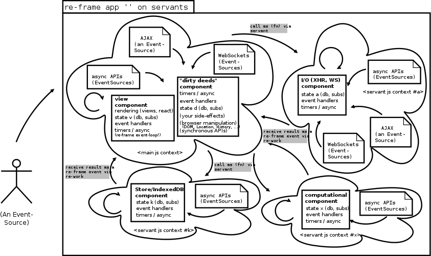

There is an unanswered question of state management and responsibility involved. Another, closely related question, is what to return from the servant facade function? Should we add a gate and wait for a ```:done``` event to send a result, presumably a portion of the local app-db, back? Should we add a way to access the foreign context app-db directly? What about different app-dbs in the main js context vs. the worker contexts?

Of course _global_ state synchronization is trivial (a handler ```(register-handler :sync-it! (fn [db [_ new-db]] new-db))``` and ```(defservantfn sync-it! [new-db] (dispatch [:sync-it! new-db]))``` is all that's required to bring one js context to reflect the state of another js context (assuming, of course, we don't have hidden mutable state!). But the question of _responsibility_ for the state arises, also there is an evolving non-empty set of keys in the state that are only of interest to a foreign js context (and, in particular, not to the main js context!). In other words, a local cache of values evolves that we don't really want to bust. Globally syncing state (presumably) from the main context into the worker contexts is easy to achieve but limiting.

#### Making our way back

While we were gazing at the innards of [servant] to understand how it will impact our own application, we have noticed one thing: Workers are nearly trivially easy to use. Plus what servant itself is doing (_its_ event handling loop) is pretty self-explanatory and short as well. In our first sketch of the [distributed computation](#distributed-computation), we omitted all the arrows for the data flow. Was the fact that we can call ```postMessage``` in both directions too trivial? servant certainly exhibits the knobs via its encoding function. But it also does more work to automatically have the result make their way back. But... do we _need_ the results (as in, private foreign context state) in our main js context? Essentially all we need to know is what we want to show. So the question is "some of it, probably". The rest may return in its black box for all we care.

So let's revisit responsibilities. We began our journey with something akin the following which we shall call the monolith.

**The Monolith**

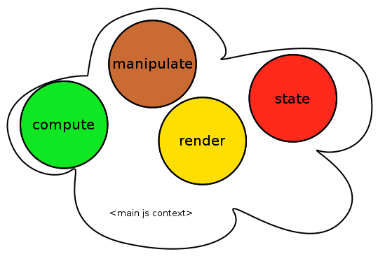

and we want to spread out computation. Our first stop on our way had us evaluate [servant] and what necessities it exhibits. With spreading plain API calls onto worker threads (or thread pools), we handle the additional contexts as slave workers, without responsibility (or additional possibilities) with regard to state management. Data is copied across the threshold in both directions for each API call wrapped this way (with ```(defservantfn)```). With one responsible party and a lot of slaves, let's call this the plantation:

**The plantation**

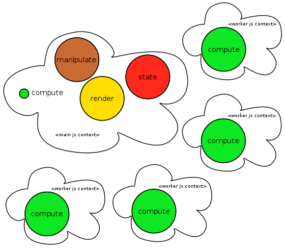

In our critique of the servant solution we have come to the realization that workers and the re-frame app is a natural fit. We are beginning to divide responsibilities of our application so that it using workers is a natural fit into our (re-frame event- and subscription-) API. The goal is to evolve towards mostly emancipated workers with local responsibility and power (db & event loop with handlers) which communicate with ... events, while the high frequency events are preferrably triggered and handled within the same worker. We shall call this the team:

**The team**


And while we're at moving state and computation away from the main context, why not get rid of _all_ of it but the most necessary pieces so our "dirty deeds" can be done? And introduce a single worker, whose job it is just to hold the global state of the application, while our main js context concentrates on as little state as possible. The majority of computation (and state manipulation!) now happens asynchronously in foreign, isolated js contexts. We now have a manager who does the real work but remains in the shadows, plus one context for representational purposes. Additionally a grey hidden workforce churns. Let's call this the republic:

**The republic**

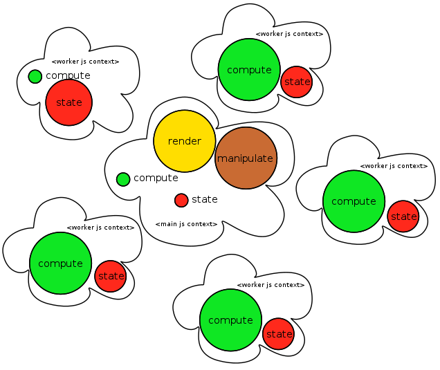

#### Multiple me's and the {monolith,plantation,team,republic}

What happens when the end-user initiates our application multiple times (as in, multiple contexts open at the same time, two tabs open for example). This is only interesting in the case when these contexts can communicate (i.e., are within the same runtime environment), because when they cannot, there is no means of sharing state or computations directly. We shall consider the case of going from _me_ to _me and myself_ and postulate that induction will take care of _me, myself and I_ and all the further increments.

**me, myself and the monolith** - In this case the application simply does the work the application does multiple times. There's multiple top-level contexts, each with their own state and setup for computation. Not only are those contexts isolated from each other, but they are ignorant as well. If state transitions in for _me_ and _myself_ initiate I/O with the outside, there _is_ already a split-brain situation. 

**me, myself and the plantation** - If the plantation is implemented using [servant], that means we are bound to using plain [WebWorker]s. These are private and not shareable. The verdict is the same as for the monolith: without other means of first-class synchronization between top-level contexts work is duplicated, state is isolated from each other, and the applications are ignorant of each other. Was there a _plantation_ implementation using shared or service workers, there would be potential for sharing access to the slaves, rendering the only requirement of leaving them pristine post-usage. XXX: This is worth re-visiting (as in, provide code to run servant facade on shared workers and service workers).

From hereon out, we shall assume that there is some implementation which allows us which worker to use. Additionally we are concerning ourselves with the possibility of sharing workers between top-level application contexts. If we weren't, the net result in the evaluation of multiple top-level accesses does not change from the above.

**me, myself and the team** - Here we regard _me_ and _myself_ as the manager of the team. There is potential to re-using the services of the team members of another manager, but only if the team members have been prepared before-hand to deal with the additional context of routing results back to the caller. Local state build-up in the team members is supported (and encouraged), as long as the context remains clear. Even though a lot of services are being re-used, the _global_ state is reproduced and we are letting the end-user face two separate application entities.

**me, myself and the republic** - As usual in a republic, if you replace the representational part, nothing in the machinery itself changes. This is a curse and a chance as well. Multiple top-level invocations of the application have the ability to access a shared state natively. Picture an online shooter where you can have, e.g., a live top-scorer list or a full-display map of the play area in an additional open tab, accessing the same global state as the game itself.

We should have a feeling of full circle with regards to [distributing computation](#distributing-computation) when looking at the republic and the team. If having one re-frame event loop per context is fine, state and computation is locally bundled together to persist in this worker, then we can move our re-frame components between workers (and/or the main context) without having to adjust their API. They remain just handlers that interact with other handlers, there's no synchronous threshold involved. ...assuming we find a way to route events and data updates, which shall be the next stops of our journey.

## Event Flow

The event flow is made up by bits and pieces used together: _dispatching_ an event to put it on the queue of events to be handled; _routing_ this event, i.e., the process of determining the correct handler to apply to the event; _handling_ the event, as in calling its handler; loop all of this.

When looking at the _monolith_ or the _plantation_, there is only one entity responsible for handling events, so there is nothing new to be said about their event flows. Even the plantation slaves cannot induce events, best they can do is come up with suggestions which further events to handle. If we trust our slaves, we can just inject those events into our event veins. Nonetheless, the event handling itself does not change.

This is different as soon as we allow our workforce a bit more consciousness, as now instead of simple orders, communication and coordination has to be possible between the different event spaces within each javascript context. With the multiple entities, each has its private dispatcher/router/handler space, as they share no data across the js contexts. Yet at the same time the set of events to be handled spans across all their combined shoulders. So, globally, we have a few choices which enable cross-context event integration.

### Patching Event Dispatch

The first approach we'll evaluate is to replace the first bit of the dispatcher/router/handler trio. Our patched dispatch routine allows us to specify not only which events and arguments to dispatch, but also _where to_. As events, unlike function calls, produce no results for the dispatcher, that's all we need to add to make our new dispatch functional. So ```(dispatch [:witty 42])``` becomes ```(dispatch' witty-worker [:witty 42])``` which enables any worker to post an event into ```witty-worker```'s event loop. Remember, if we need information "back" from the other worker, our event choreography will ```(dispatch' manager [:witty-response "it's the answer"])``` down the road, which will give us a return channel for data via events across these workers. Addressing of workers must remain static at this stage. To achieve dynamic worker addressing, the handling of the worker registry etc. would need to be visible as a first-class citizen of our application, just as threshold-crossing points will be visible by explicit use of ```(dispatch')```.

### Patching Event Routing

The second approach is to leave dispatch untouched, and instead concentrate on the router bit. Our patched router would _know_ which worker handler resides in which worker space, wrap the event up for cross-context transport, and put it onto the foreign worker's context (assume we had a function ```(dispatch')``` which could do this for us). Our ```(router-loop')``` could offer ways to dynamically access (and change) the mapping of events to workers. As the routing itself is dynamic, worker pools (sequentially alternating dispatches) could be had as well. The use of this feature would be behind the scenes of our re-frame application, thus not visibly impacting the code.

### Patching Event Handling

The third approach would be to leave dispatch and event routing intact, but instead patch ```(handler)``` to off-load the computation to another worker. This ```(handler')``` would call ```(handle)``` in the foreign context. Information on where to dispatch the computation to could be explicitly stored in the event data (thus tainting your state), or statefully (and globally) managed in a way so that ```(handler')``` can access it to determine which worker to offload the computation to. Just as with a patched event router, this dynamic routing setup would be less local and visible than in the event dispatch patch approach. At the same time, this worker routing setup is the only change from the present code of our re-frame app.

### Routing Registry

Every approach above needs some help with deciding on the target for the event. ```(dispatch')``` has the address (or its lookup) explicitly next to the event. ```(router-loop')``` and ```(handler')``` both separate the registry from their ("natural") API by implying its existence and access to it. This documents the necessity of a worker dispatch table that can return the correct worker to ```.postMessage``` something to. Yet what should be the key to this map? Conceptually there is a difference in the lookup the patched router does vs. the lookup of the patched handler. The former wants to "find a handler" based on the event (-key). The latter wants to get the job done. So naturally, the event key would qualify for the lookup key of the patched router. But what would the patched handler use? Conceptually, it seems to be most closely related to the _computation_, but this computation has been looked up with the event as a key! So the event-key looks like a good fit for the routing registry key.

Of the existing API, we already explicitly specify the event key when we register handler functions. We could alter this registration process to include the routing registry information. Or we could use specialized utility functions that document and establish the routing registry. Either way, looking at our event handlers, we would want this routing information to be locally close to the handler registrations.

At the same time, we might _not_ want to update our handler registrations, or cloud the vision onto event handling by orthogonal concepts such as computational distribution. In that case, we might rather want to use a global definition structure which maps workers onto the set of keys they will handle.


### Worker Lifecycle management

#### Worker Birth Trampoline

Sadly, at least a major browser (to point a finger, I'm talking about you, chromium!) decided to not completely implement the [WebWorkerAPI]. In particular, there's a crucial derivation from the capabilities that Workers ought to have: in chrome, workers cannot create workers! So all the nice automatic features that the W3C came up with for worker parent-child relationships and their architectural implications are void. They claim one could always simulate the feature. It is somewhat similar to a systems programmer coming to implement clojure and deciding not to bother with immutable collections because they couldn't see their use. Sadly this will never be a reason for anybody to boycot the offending browser.

**What we wanted**

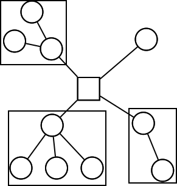

What this means, in practice, is that we cannot create architectural units that both are relocatable to a worker and at the same time tackle problems in parallel with workers launched when and how that architectural unit wants it. Instead we are faced with a situation where a compat shim has to offer us the functionality of spawning workers so that the unit becomes relocatable between js contexts and still remain functional. Alternatively, we could restrict ourselves to architectural units that do not spawn further workers, i.e., break down the units enough that, again, one unit per one context with a static setup from "the outside, once" will be good enough for us.

**What we got instead**

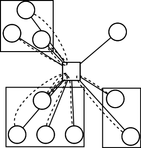

Responsibility for creating webworkers will always fall back to the main js context because of this. Sadly this creates unnecessary complexity we will just have to deal with. Our answer to this is the worker birth trampoline. It will start out as a set of utilities for the main js context that launches workers, but naturally evolve towards being able to wire together the ```MessagePort``` interfaces of the created workers. When this is done, the trampoline can begin answering requests for launching workers and wiring them up accordingly within the main js context. Keep in mind that this puts pressure no the main js event loop though. With the republic, above, we have to wonder whether it's possible to alter the picture slightly, and put the work of event routing between workers into its own worker (the president, so to speak).

**Presidial Routing**

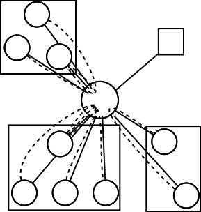

In fact, ```MessagePort```s are _transferrable_, i.e., we can let go of a message port object in one js context to receive it in another. This transferred ```MessagePort``` can be used in the receiving context to set up the event handling loop. Now we have moved the piping together of worker events off the main js context event loop and put it into the worker instead. This requires a sertain set of hoops to jump through in the following choreography.

**Worker Birth Choreography**

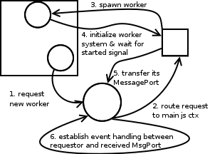


### Shopping List => API

- Routing Registry
- Event trampoline for workers
- wrapper for receiving messages back
- life cycle management of workers
- event loop across them all

### Paths

- monolith : re-frame

From hereon out, all need life cycle management

- plantation: shared, non-shared. Optional routing registry. May implement pooling easily. Optional trampoline in worker. Optional wrapper in main. Least work, most impact on API...
- team: shared, non-shared. Likely Routing registry. Pooling is hard (state sync). trampoline, wrapper, event loop.
- republic: see team.

## Logging And Debugging

- remember, console API is available to all workers.
- logging events ...
- debugging ? with .. events! ..and middleware!
- dirty deeds - the perfect receiver

## Talking To A Server

- talking to one server from one worker
- talking to multiple/dynamic endpoints from one worker (component state)

## The CPU Hog Problem Revisited

- explain impact of different approaches with our example application

## Worker applications

- down to leining profile settings, what do we need to do?

## Licence

Copyright © 2015 Michael Thompson (re-frame)

Copyright © 2015 Martin S. Weber (re-work)

Distributed under The MIT License (MIT) - See LICENSE.txt

[seems to be]:http://stackoverflow.com/questions/13574158/number-of-web-workers-limit
[data transfer]:https://html.spec.whatwg.org/multipage/infrastructure.html#safe-passing-of-structured-data
[Transferable]:https://developer.mozilla.org/en-US/docs/Web/API/Transferable
[servant]:https://github.com/MarcoPolo/servant
[WebWorkerAPI]:https://developer.mozilla.org/en-US/docs/Web/API/Web_Workers_API
[WebWorker]:https://developer.mozilla.org/en-US/docs/Web/API/Worker
[SharedWorker]:https://developer.mozilla.org/en/docs/Web/API/SharedWorker
[ServiceWorker]:https://developer.mozilla.org/en-US/docs/Web/API/Service_Worker_API
[component]:https://github.com/stuartsierra/component
[re-frame]:https://github.com/Day8/re-frame
[SPAs]:http://en.wikipedia.org/wiki/Single-page_application
[SPA]:http://en.wikipedia.org/wiki/Single-page_application
[Reagent]:http://reagent-project.github.io/
[Dan Holmsand]:https://twitter.com/holmsand
[Flux]:http://facebook.github.io/flux/docs/overview.html#content
[Hiccup]:https://github.com/weavejester/hiccup
[FRP]:https://gist.github.com/staltz/868e7e9bc2a7b8c1f754
[Elm]:http://elm-lang.org/
[OM]:https://github.com/swannodette/om
[Prismatic Schema]:https://github.com/Prismatic/schema
[datascript]:https://github.com/tonsky/datascript
[Hoplon]:http://hoplon.io/
[Pedestal App]:https://github.com/pedestal/pedestal-app
